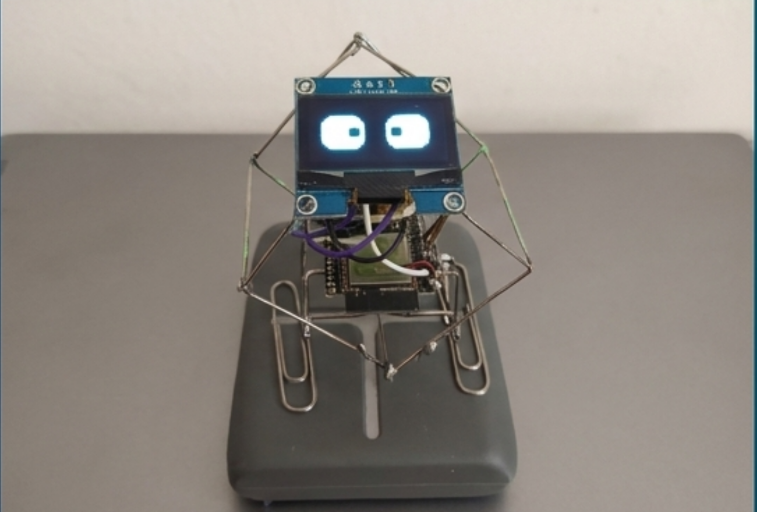

# ESP32-S3 AI Desktop Bot


<p align="center">
  
</p>

An advanced ESP32-S3 based conversational desktop bot featuring Voice Activity Detection (VAD), continuous conversation session management, and integrated generative AI via a Python server (powered by Google Gemini). The bot features an expressive OLED animated face and supports natural, continuous voice interactions.

## Features

- **Wake Word Detection**: Activated by a customizable wake word using Espressif's ESP-SR.
- **Natural Conversations**: Uses generative AI (Gemini) through a Python backend for open-ended, contextual back-and-forth conversations.
- **Voice Activity Detection (VAD)**: Smartly detects when you speak and automatically stops recording after a period of silence to seamlessly continue the conversation.
- **Session Management**: Maintains conversational context over multiple interactions, with server-side signals to safely terminate the session.
- **Animated Display**: Expressive OLED face animations synchronized with bot states (Idle, Listening, Speaking).
- **Hardware Optimized**: FreeRTOS multi-core task distribution for efficient audio processing, network streaming, and UI rendering.

## Hardware Requirements

- ESP32-S3-DevKitC-1-N16R8 (16MB Flash, 8MB PSRAM)
- OLED Display (I2C, 128x64)
- Microphone Options: I2S Digital (e.g., INMP441, ICS-43434) or Analog with gain control
- Speaker Options: I2S Amplifier (e.g., MAX98357A) connected to a speaker

## Dependencies

- Platform: ESP32 Arduino (Custom platform with ESP-SR support)
- Libraries:
  - U8g2 (OLED Graphics)
  - ESP-SR (Speech Recognition)
  - ESP-Skainet (Wake Word Models)

## Installation

1. Install PlatformIO (VSCode Extension or CLI).

2. Clone the repository:
   ```bash
   git clone https://github.com/jahrulnr/ESP32-WakeWord.git
   cd ESP32-WakeWord
   ```

3. Configure hardware settings in `include/app_config.h` (Microphone and Display pins).

4. Update Backend Configuration in `src/app/tasks/ConversationTask.cpp`:
   ```cpp
   #define SERVER_HOST "192.168.1.9" // Set this to your Python backend IP address
   #define SERVER_PORT 5000
   ```

5. Build and upload:
   ```bash
   pio run -t upload
   ```

6. **Python Backend**: Make sure to run the corresponding Flask backend server with Gemini integration so the bot has an endpoint to stream audio to.

## ⚡ Architecture

### Task Distribution
- **Core 0**: Speech recognition and Audio Streaming
  - Priority 8
  - Handles ESP-SR wake word, VAD silence detection, audio recording via I2S, and HTTP multipart audio streaming to the server.
- **Core 1**: Display and animations
  - Priority 19
  - Manages UI updates and dynamic face expressions using custom MochiDisplay and FaceDisplay logic.

### Memory Configuration
- Custom partition table (`hiesp.csv`)
- PSRAM heavily utilized for audio buffering (`AUDIO_BUF_SIZE`) and parsing HTTP chunked audio responses during playback.

## Model Management

For detailed instructions on building, packaging, and flashing ESP-SR models, see the [ESP-SR Model Management Guide](model/README.md). The guide includes:
- Model structure and organization
- Build and flash instructions
- Troubleshooting common model issues

## Troubleshooting

1. **Audio/Network Issues**
   - Ensure the ESP32 is connected to the same local network as the Python backend.
   - Verify 16kHz sample rate configuration and I2S pin routing.
2. **Build Errors**
   - Clean build: `pio run -t clean`
   - Check PSRAM configuration.
3. **Display Problems**
   - Verify I2C pins in `app_config.h`.


## Acknowledgments
-https://github.com/jahrulnr/ESP32-WakeWord
- [ESP-SR Framework](https://github.com/espressif/esp-sr) by Espressif
- [U8g2 Library](https://github.com/olikraus/u8g2)
- Original face animations based on [ESP32-Eyes](https://github.com/playfultechnology/esp32-eyes)
- AI integration powered by Google Gemini via Python Flask Backend
